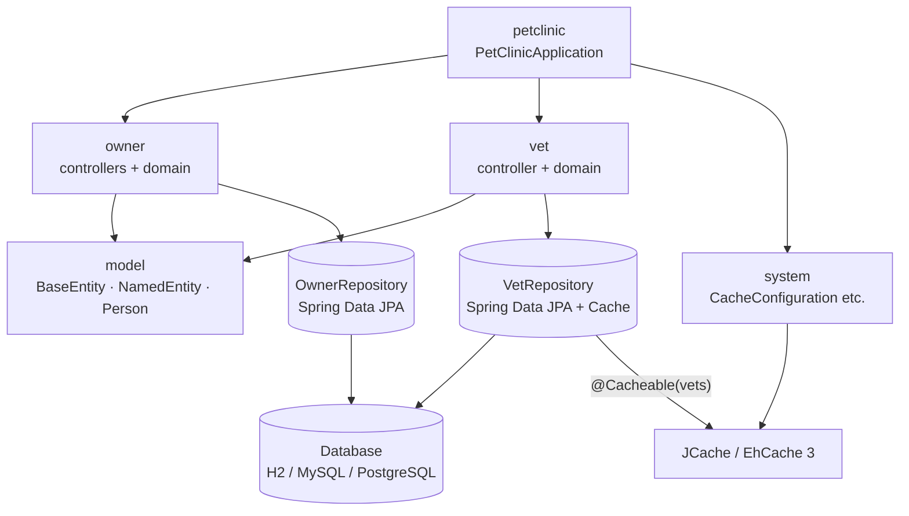

# Architecture Analysis — Spring PetClinic (Legacy Baseline)

> Analysed commit: `a5cbb8505a1df3c348c06607933a07fc8c87c222` (2022-10-16)  
> Analysed on: 2026-09-26  
> Analyst: IBM Bob (LegacyLift project)

> **Post-migration corrections (verified against the code on 2026-09-26).** This analysis was
> written by Bob *before* the migration and is kept unchanged as a record. Human review and the
> migration itself found these inaccuracies:
>
> 1. **javax file count (§6a, §7):** 14 files used `javax.*` imports, not 10. `NamedEntity`,
>    `PetType`, `Specialty` and `Vets` were missed; `Vets` also uses JAXB (`@XmlRootElement`).
>    The migration prompt therefore used `grep` as the source of truth, and all 14 were migrated.
> 2. **`javax.cache` (§6e, §7):** the JCache API stays in the `javax.cache` package in Spring Boot 3.
>    It must not be renamed to `jakarta.cache`; only the Ehcache `jakarta` classifier is needed.
> 3. **`VetRepository#findAll()` (§6c):** not deprecated; no change was required.
> 4. **`spring.jpa.open-in-view` (§6c):** no startup warning is printed, because the property is set
>    explicitly to `true`.
> 5. **Actuator security (§6d, §7):** the project has no Spring Security, so Boot 3 does not require
>    extra security configuration; endpoint exposure behaves as before.
>
> See `reports/CHANGELOG.md` and `reports/MIGRATION_REPORT.md` for what was actually changed.

---

## 1. Overview

Spring PetClinic is a classic Spring reference application that models a simple veterinary
practice management system. It allows clinic staff to create and update **owner** records, register
their **pets** (with breed/type and birth date), schedule and record **visits** to the clinic, and
browse the list of **veterinarians** together with their specialties. The application is structured
as a standard Spring Boot MVC monolith: an embedded Tomcat server serves Thymeleaf-rendered HTML
pages backed by a Spring Data JPA persistence layer. H2 is used as the default in-memory database,
with optional MySQL and PostgreSQL profiles available via Spring Boot property files. The data
model is hierarchical — an `Owner` owns many `Pet` objects, and each `Pet` has an ordered set of
`Visit` records; the entire owner aggregate is persisted through a single `OwnerRepository`.
Spring Cache (backed by EhCache 3 / JSR-107) is used to cache the vet list, which is expensive to
load and changes infrequently. Spring Boot Actuator exposes all management endpoints, and the
`git-commit-id-plugin` injects build metadata into the `/actuator/info` endpoint at startup.

---

## 2. Tech Stack

| Layer / Concern | Library | Version |
|-----------------|---------|---------|
| **Java target** | OpenJDK (bytecode target) | **1.8** (compiled with JDK 11) |
| **Framework** | Spring Boot | **2.7.3** |
| **Build tool** | Maven (via wrapper `mvnw`) | 3.8.2 |
| **Web / MVC** | spring-boot-starter-web (Spring MVC + embedded Tomcat) | 2.7.3 |
| **Templating** | spring-boot-starter-thymeleaf | 2.7.3 |
| **Persistence** | spring-boot-starter-data-jpa (Hibernate 5 + Spring Data JPA) | 2.7.3 |
| **Validation** | spring-boot-starter-validation (Hibernate Validator / Jakarta EE 8) | 2.7.3 |
| **Caching** | spring-boot-starter-cache + EhCache 3 + `javax.cache:cache-api` | 2.7.3 / 3.x |
| **Monitoring** | spring-boot-starter-actuator | 2.7.3 |
| **Database (default)** | H2 (in-memory) | managed by Boot BOM |
| **Database (optional)** | MySQL Connector/J | managed by Boot BOM |
| **Database (optional)** | PostgreSQL JDBC | managed by Boot BOM |
| **Frontend** | Bootstrap (WebJar) | 5.1.3 |
| **Frontend** | Font Awesome (WebJar) | 4.7.0 |
| **Dev tooling** | spring-boot-devtools | 2.7.3 |
| **Coverage** | JaCoCo Maven Plugin | **0.8.7** |
| **Code style** | spring-javaformat-maven-plugin | 0.0.31 |
| **Code style** | maven-checkstyle-plugin + Checkstyle | 3.1.2 / 8.45.1 |
| **Build info** | git-commit-id-plugin | 4.9.10 |
| **Test** | spring-boot-starter-test (JUnit 5, Mockito, AssertJ) | 2.7.3 |

---

## 3. Module Map

| Package | Responsibility | Key Classes |
|---------|---------------|-------------|
| `…petclinic` | Application entry point; Spring Boot bootstrap | `PetClinicApplication` |
| `…petclinic.model` | Shared JPA base entities used across the domain | `BaseEntity`, `NamedEntity`, `Person` |
| `…petclinic.owner` | Full owner/pet/visit domain: entities, controllers, repository, formatter, validator | `Owner`, `Pet`, `PetType`, `Visit`, `OwnerController`, `PetController`, `VisitController`, `OwnerRepository`, `PetTypeFormatter`, `PetValidator` |
| `…petclinic.vet` | Veterinarian domain: entity, JAXB wrapper, paginated controller, cached repository | `Vet`, `Specialty`, `Vets`, `VetController`, `VetRepository` |
| `…petclinic.system` | Cross-cutting infrastructure: caching configuration, error page, welcome page | `CacheConfiguration`, `CrashController`, `WelcomeController` |

---

## 4. Dependency Diagram



---

## 5. Request Flow — "Find Owner by Last Name"

The following traces a `GET /owners?lastName=Franklin&page=1` request end-to-end.

```
Browser
  │  GET /owners?lastName=Franklin&page=1
  ▼
DispatcherServlet   (Spring MVC front controller)
  │  matches route → OwnerController#processFindForm
  ▼
OwnerController#processFindForm(page=1, owner, result, model)
  │  1. Sets owner.lastName = "Franklin" (from request param)
  │  2. Calls findPaginatedForOwnersLastName(1, "Franklin")
  ▼
OwnerController#findPaginatedForOwnersLastName(page, lastName)
  │  Builds PageRequest.of(0, 5)
  │  Calls OwnerRepository#findByLastName("Franklin", pageable)
  ▼
OwnerRepository (Spring Data JPA proxy)
  │  Executes JPQL:
  │    SELECT DISTINCT owner FROM Owner owner
  │    LEFT JOIN owner.pets
  │    WHERE owner.lastName LIKE 'Franklin%'
  │    LIMIT 5 OFFSET 0
  ▼
Hibernate ORM  →  H2 / MySQL / PostgreSQL
  │  Issues SQL SELECT against `owners` + LEFT JOIN `pets`
  │  Returns ResultSet → hydrates Owner + Pet objects
  ▼
OwnerRepository  returns  Page<Owner>
  ▼
OwnerController
  │  If 1 result  → redirect:/owners/{id}
  │  If >1 results → addPaginationModel(page, model, results)
  │                  returns "owners/ownersList"
  ▼
ThymeleafViewResolver  renders  owners/ownersList.html
  ▼
Browser  ←  200 OK  HTML page
```

**Key objects crossing layer boundaries:**

| Boundary | Object |
|----------|--------|
| Controller → Repository | `String lastName`, `Pageable` |
| Repository → Controller | `Page<Owner>` (with eager `pets` collection) |
| Controller → View | Spring `Model` attributes: `listOwners`, `currentPage`, `totalPages`, `totalItems` |

---

## 6. Migration Inventory

Every item that must change to reach **Java 21** and **Spring Boot 3.x**.

### 6a. `javax.*` → `jakarta.*` import replacements

Spring Boot 3 / Jakarta EE 10 drops all `javax.*` namespaces in favour of `jakarta.*`.

| File | Current import(s) |
|------|-------------------|
| `src/main/java/…/model/BaseEntity.java` | `javax.persistence.{GeneratedValue, GenerationType, Id, MappedSuperclass}` |
| `src/main/java/…/model/Person.java` | `javax.persistence.{Column, MappedSuperclass}`, `javax.validation.constraints.NotEmpty` |
| `src/main/java/…/owner/Owner.java` | `javax.persistence.{CascadeType, Column, Entity, FetchType, JoinColumn, OneToMany, OrderBy, Table}`, `javax.validation.constraints.{Digits, NotEmpty}` |
| `src/main/java/…/owner/Pet.java` | `javax.persistence.{CascadeType, Column, Entity, FetchType, JoinColumn, ManyToOne, OneToMany, OrderBy, Table}` |
| `src/main/java/…/owner/Visit.java` | `javax.persistence.{Column, Entity, Table}`, `javax.validation.constraints.NotEmpty` |
| `src/main/java/…/owner/OwnerController.java` | `javax.validation.Valid` |
| `src/main/java/…/owner/PetController.java` | `javax.validation.Valid` |
| `src/main/java/…/owner/VisitController.java` | `javax.validation.Valid` |
| `src/main/java/…/vet/Vet.java` | `javax.persistence.{Entity, FetchType, JoinColumn, JoinTable, ManyToMany, Table}`, **`javax.xml.bind.annotation.XmlElement`** |
| `src/main/java/…/system/CacheConfiguration.java` | `javax.cache.configuration.MutableConfiguration` |

### 6b. `javax.xml.bind` (JAXB) removal

JAXB was removed from the JDK in Java 11 and from `javax.*` in Jakarta EE 10.

| File | Issue |
|------|-------|
| `src/main/java/…/vet/Vet.java` | `@XmlElement` from `javax.xml.bind.annotation` — must be replaced with `jakarta.xml.bind.annotation.XmlElement` **and** `jakarta.xml.bind:jakarta.xml.bind-api` added as a dependency, or the annotation removed if JSON-only serialisation is acceptable |

### 6c. Deprecated APIs

| File | Issue |
|------|-------|
| `src/main/resources/application.properties` | `spring.jpa.open-in-view=true` — still works in Boot 3 but prints a loud warning; should be set to `false` or explicitly acknowledged |
| `src/main/java/…/vet/VetController.java` | `VetRepository#findAll()` (no-arg, returns `Collection<Vet>`) — used in `showResourcesVetList()`; the paginated overload is preferred for Boot 3 style |

### 6d. Changed / removed configuration property keys

| Old key (Boot 2) | New key (Boot 3) | File |
|------------------|-----------------|------|
| `spring.sql.init.schema-locations` | Unchanged — but `spring.sql.init.*` was introduced in 2.5; still valid in 3 | `application.properties` |
| `spring.web.resources.cache.cachecontrol.max-age` | Unchanged | `application.properties` |
| `management.endpoints.web.exposure.include=*` | Unchanged, but security defaults changed — unauthenticated exposure of all endpoints now requires explicit opt-in | `application.properties` |
| `spring.datasource.*` in MySQL/Postgres profiles | `spring.datasource.url` driver class name format unchanged, but `mysql-connector-java` group changed to `com.mysql:mysql-connector-j` | `application-mysql.properties` |

### 6e. Outdated / renamed dependencies

| Dependency | Current version | Required action |
|------------|-----------------|----------------|
| `javax.cache:cache-api` | (Boot BOM) | Replace with `jakarta.cache:cache-api` or remain on `javax.cache` via explicit override — EhCache 3.10+ supports both |
| `mysql:mysql-connector-java` | (Boot BOM) | Rename to `com.mysql:mysql-connector-j` (groupId changed upstream in 8.0.31) |
| `org.jacoco:jacoco-maven-plugin` | **0.8.7** | Must be upgraded to **≥ 0.8.8** for Java 17+ bytecode support; **≥ 0.8.11** recommended for Java 21 |
| `pl.project13.maven:git-commit-id-plugin` | 4.9.10 | Replaced by `io.github.git-commit-id:git-commit-id-maven-plugin` for Boot 3 |
| `io.spring.javaformat:spring-javaformat-maven-plugin` | 0.0.31 | Upgrade to ≥ 0.0.38 for Java 17/21 support |
| `spring-boot-starter-parent` | 2.7.3 | Upgrade to **3.x** (latest 3.3.x LTS recommended) |

---

## 7. Risk List

| Risk | Level | Reason |
|------|-------|--------|
| Mass `javax.*` → `jakarta.*` rename across 10 files | **High** | Every JPA entity and every controller that uses Bean Validation needs touching; a missed import breaks compilation silently at test time |
| `javax.xml.bind.annotation.XmlElement` on `Vet` | **High** | JAXB is not on the module path in Java 11+ by default; `Vet` is used by a JSON endpoint (`GET /vets`) so removing the annotation changes serialisation behaviour unless tested |
| JaCoCo 0.8.7 incompatibility with Java 17/21 bytecode | **High** | Build fails at the `prepare-agent` step when the compiler target exceeds what this JaCoCo version understands; blocks CI before any code change |
| `git-commit-id-plugin` groupId/artifactId change | **Medium** | Plugin no longer published under `pl.project13.maven`; build fails to resolve the artifact if not updated |
| `spring.jpa.open-in-view=true` | **Medium** | Retained in Boot 3 but flagged as an anti-pattern; lazy-loading paths that silently work today may throw `LazyInitializationException` once it is disabled |
| `mysql:mysql-connector-java` groupId rename | **Medium** | Dependency resolution will fail for the MySQL profile until the groupId is corrected to `com.mysql:mysql-connector-j` |
| EhCache 3 / `javax.cache` namespace | **Medium** | EhCache 3.10 bridges both `javax.cache` and `jakarta.cache`; upgrading Boot triggers the `jakarta` requirement, which may require explicit EhCache version override |
| Actuator security defaults tightened in Boot 3 | **Medium** | `management.endpoints.web.exposure.include=*` exposes all endpoints; Boot 3 requires explicit security configuration — no functional breakage but a security gap |
| `spring-javaformat` version mismatch | **Low** | Older plugin versions reject Java 17 source format rules, causing `validate` phase failure — easy fix but must not be overlooked |
| Paginated vs. unbounded `VetRepository#findAll()` | **Low** | Returns `Collection<Vet>` without pagination; acceptable for small data sets but an OOM risk at scale and inconsistent with the rest of the API |

---

## 8. Test Targets

### Which classes most need characterisation tests before migration

#### `owner` package

| Class | Why it needs tests | Already covered? | Gap |
|-------|--------------------|-----------------|-----|
| `Owner` | Contains non-trivial domain logic: `getPet(String, boolean)`, `getPet(Integer)`, `addPet()` (guards against duplicates for new pets), `addVisit()` (delegates to `Pet` with null-guards via `Assert`). These methods are the aggregate root — behaviour must be locked in before any refactor. | **Partially.** `OwnerControllerTests` and `ClinicServiceTests` exercise `Owner` indirectly via HTTP and DB. The domain methods (`getPet` overloads, `addVisit` null-guard) have **no direct unit tests**. | Unit tests for `Owner#getPet(String, boolean)`, `Owner#getPet(Integer)`, and `Owner#addVisit(Integer, Visit)` including null/invalid petId paths are missing. |
| `OwnerController` | All 7 request mappings (create, find, show, edit). Validation paths, redirect-on-single-result logic, and pagination model population. | **Well covered.** `OwnerControllerTests` has 12 `@WebMvcTest` cases covering all public handlers and both happy-path and error paths. | Minor gap: `processFindForm` with `lastName=null` (triggers broadest search) is not explicitly tested. |
| `PetController` | Create/update pet, `PetTypeFormatter` integration, duplicate-name guard in `processCreationForm`. | **Covered.** `PetControllerTests` has 6 cases including error paths and formatter. | Gap: duplicate-pet-name rejection path (`result.rejectValue("name", "duplicate")`) is not tested. |
| `PetValidator` | Validates `name`, `type` (new pets only), and `birthDate`. Pure logic with no Spring dependency. | **Not directly tested.** Validation is exercised indirectly through `PetControllerTests` HTTP calls, but there is no focused `PetValidator` unit test. | Add a `PetValidatorTests` class covering: blank name, null type on new pet, type present on existing pet (should not error), null birthDate. |
| `PetTypeFormatter` | Parses a String to `PetType` by querying `OwnerRepository`; throws `ParseException` for unknown types. | **Covered.** `PetTypeFormatterTests` has 3 cases: successful parse, `ParseException` for unknown type, and print. | No gap. |

#### `visit` (`VisitController` lives in `owner` package)

| Class | Why it needs tests | Already covered? | Gap |
|-------|--------------------|-----------------|-----|
| `VisitController` | `loadPetWithVisit` `@ModelAttribute` adds a blank `Visit` to the pet on every request (side effect); `processNewVisitForm` saves via `Owner#addVisit`. Behaviour must be verified before the `javax.validation` → `jakarta.validation` rename. | **Covered.** `VisitControllerTests` has 3 cases: init form, success post, and validation error post. | Gap: the `loadPetWithVisit` side-effect (visit appended to pet before handler runs) is observable in the success test but not asserted explicitly. A test that verifies the `Pet` in the model has the new `Visit` pre-attached would lock this in. |
| `Visit` | Simple entity: default constructor sets `date = LocalDate.now()`; only constraint is `@NotEmpty description`. | **Covered indirectly** by `ClinicServiceTests#shouldAddNewVisitForPet` and `shouldFindVisitsByPetId`. | Gap: no unit test verifying that `new Visit()` sets today's date; if the constructor changes during migration, no test catches it. |

### Summary of gaps

| Priority | Missing test | Suggested class |
|----------|-------------|----------------|
| 🔴 High | `Owner` domain logic (`getPet` overloads, `addVisit` null-guard) | `OwnerTests` (new) |
| 🔴 High | `PetValidator` rules in isolation | `PetValidatorTests` (new) |
| 🟡 Medium | `Visit` default constructor date | `VisitTests` (new) |
| 🟡 Medium | `VisitController` — assert pre-attached visit in model | extend `VisitControllerTests` |
| 🟢 Low | `OwnerController#processFindForm` with null `lastName` | extend `OwnerControllerTests` |
| 🟢 Low | `PetController` duplicate-pet-name rejection | extend `PetControllerTests` |
